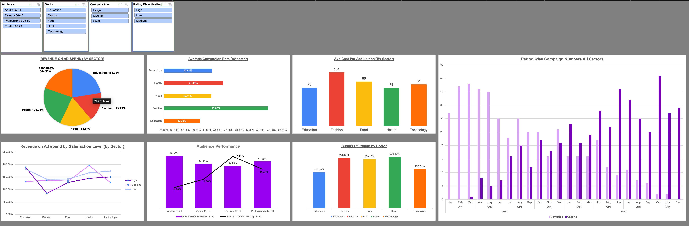

# 📊 Sales & Campaign Performance Analysis

> **Multi-sector marketing campaign analysis across 5 industries — identifying 
> ROI drivers, audience performance, and operational inefficiencies 
> to inform 2026 budget planning.**

---
## 📸 Dashboard Preview

## 🗂️ Project Overview

| Detail | Info |
|--------|------|
| **Tools Used** | Microsoft Excel (Pivot Tables, Charts, Slicers, Dashboard) |
| **Sectors Analysed** | Education · Fashion · Food · Health · Technology |
| **Audiences Analysed** | Youths 18–24 · Adults 25–34 · Parents 30–40 · Professionals 35–50 |
| **Key Metrics** | ROAS · CTR · CVR · CPA · Budget Utilisation · Revenue |
| **Deliverable** | Interactive Excel Dashboard + Stakeholder Presentation |

---

## ❓ Business Questions

1. Which sectors generate the strongest Return on Ad Spend (ROAS)?
2. Which audiences convert at the highest rate?
3. Where are cost-per-acquisition inefficiencies hiding?
4. How effectively are campaign budgets being managed?
5. Does customer satisfaction correlate with campaign performance?
6. How have campaign patterns shifted from 2023 to 2024?

---

## 📈 Key Findings by Metric

### 🔴 Return on Ad Spend (ROAS)
| Sector | ROAS | Verdict |
|--------|------|---------|
| Health | 1.70 | ✅ Top performer |
| Education | 1.65 | ✅ Strong ROI |
| Technology | 1.45 | 🟡 Mid-range |
| Food | 1.34 | 🟡 Mid-range |
| Fashion | 1.19 | 🔴 Underperforming |

### 🟡 Conversion Rate (CVR)
| Sector | CVR | Verdict |
|--------|-----|---------|
| Fashion | 45.7% | ✅ Highest CVR |
| Health | 41.5% | ✅ Strong |
| Technology | 40.5% | 🟡 Solid |
| Food | 40.4% | 🟡 Solid |
| Education | 39.3% | 🔴 Funnel gap |

### 🟠 Cost Per Acquisition (CPA)
| Sector | CPA | Verdict |
|--------|-----|---------|
| Education | $74.55 | ✅ Most efficient |
| Health | $74.05 | ✅ Most efficient |
| Food | $86.25 | 🟡 Mid-range |
| Technology | $80.70 | 🟡 Mid-range |
| Fashion | $104.05 | 🔴 Least efficient |

---

## 💡 Strategic Insights

- 🏆 **Health & Education deliver the best ROI** — priority sectors for 2026 investment
- ⚠️ **Fashion paradox** — highest CVR (45.7%) but highest CPA ($104) — strong targeting but serious cost inefficiency
- 👥 **Best audiences** — Youths 18–24 and Professionals 35–50 show highest-quality conversions
- 📉 **Parents 30–40** — high engagement but weak CVR — messaging or relevance issue
- 💸 **Budget overspend across all sectors** — every sector exceeded planned budgets by **2.5×–2.7×** — systemic forecasting problem
- 😮 **Satisfaction ≠ Performance** — low-satisfaction campaigns actually showed the highest ROAS, indicating a client expectation gap
- 📅 **2024 trend shift** — clear move toward longer, ongoing campaigns vs completed short-burst ones in 2023

---

## 🎯 Recommendations

1. **Double down on Health & Education** — highest ROAS and cost efficiency
2. **Fix Fashion's cost structure** — CVR is strong, so the issue is CPA; optimise bid strategy and targeting costs
3. **Improve Education's conversion funnel** — lowest CVR despite strong ROAS
4. **Fix budget forecasting** — 2.5×+ overspend across all sectors is unsustainable
5. **Re-examine satisfaction scoring** — low-satisfaction = high ROAS suggests clients may have low expectations, not poor execution
6. **Adjust audience strategy** — invest more in Youths 18–24, redesign messaging for Parents 30–40

---

## 📁 Files in This Repository

| File | Description |
|------|-------------|
| [📊 View Interactive Dashboard](https://docs.google.com/spreadsheets/d/1E_Qj05VjYdkFcKKSL955HKBg6LIlBqabNwDfprmcBuY/edit?usp=sharing) | Full Excel workbook: raw data, pivot tables & interactive dashboard |
| `cleaned_dataset.xlsx` | Cleaned and transformed dataset used for analysis |
## 📑 Presentation

---

## 🛠️ Skills Demonstrated

`Data Cleaning` `Pivot Tables` `Pivot Charts` `Excel Dashboarding` `Slicers`
`KPI Analysis` `Business Storytelling` `Campaign Analytics` `Stakeholder Reporting`

---

*Analysis by [Vishwas Tilwani](https://www.linkedin.com/in/vishwas-tilwani/) — Data & Business Analyst | Sydney, Australia*
